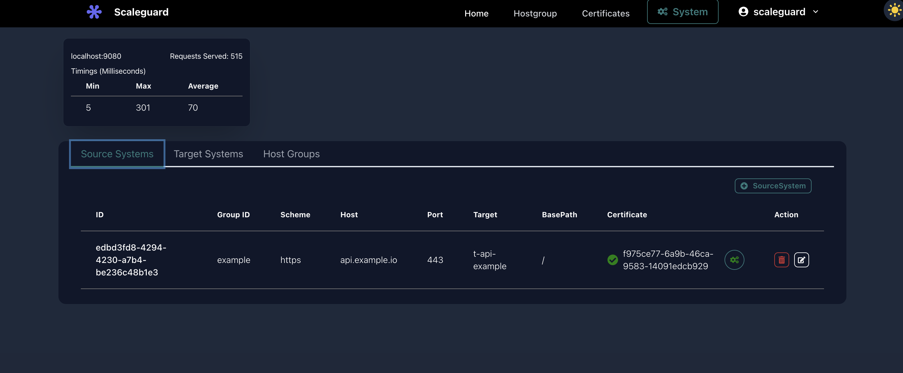

# Scaleguard
Scaleguard is a high-performance load balancer and reverse proxy designed to efficiently distribute traffic across multiple servers and ensure seamless service availability. It optimizes network performance by intelligently routing requests, balancing workloads, and providing secure exposure of services. Scaleguard enhances scalability, improves fault tolerance, and supports dynamic traffic management for distributed environments.
## Architecture

Scaleguard's architecture ensures high availability, security, and ease of management. Below is an overview of its core components:


## Landing Screen

Below is a screenshot of the Scaleguard landing screen:



## Features
- **Load Balancer**: Distributes incoming traffic across multiple backend servers to ensure optimal resource utilization and reliability.
- **Reverse Proxy**: Acts as an intermediary to handle client requests, improving security and performance.
- **SafeExpose**: Securely expose internal services to external clients with controlled access.
- **Multi-Cluster Load Balancer**: Efficiently manage traffic across multiple clusters, ensuring high availability and failover support.
- **Async API Support**: Efficiently handle asynchronous communication patterns for real-time applications or services.
- **Queuing Mechanism**: Supports queuing for efficient workload distribution and message processing.
- **Built-in Observability**: Provides real-time monitoring, logging, and tracing for improved system visibility and debugging.
- **API Support**: Facilitates seamless integration with external services through a robust API framework.
- **Dynamic Configuration API**: Enables real-time updates to configurations without requiring restarts or downtime.
- **Dynamic DNS**: Automatically updates DNS records based on changes in infrastructure, improving service discovery.
- **Automatic Certificate Provisioning**: Automated provisioning and management of SSL/TLS certificates for secure communication.
- **Request Caching**: Stores frequently requested content at the load balancer level to improve response times and reduce load on backend servers.
- **High Scalability**: Efficiently handles a large number of concurrent connections and scales horizontally as demand increases.


## Getting Started

### Prerequisites
Ensure the following dependencies are installed before running Scaleguard:
- Java (JDK 11 or later)
- Node.js (for Admin UI)
- Maven (for building the backend)
- Git

### Installation & Setup

#### Cloning the Repository
```sh
git clone https://github.com/dhaneeshtb/scaleguard.git
cd scaleguard
```


### Running Scaleguard Server

#### Build and Start the Server Locally
```sh
mvn clean install
java -DadminUser=scaleguard -DadminPassword=Scaleguard123$ -jar target/scaleguard-1.0-SNAPSHOT.jar
```

## 🚀 Production Deployment

Follow these steps to deploy **Scaleguard** in a production environment.

---

### 🔧 Step 1: Build the Application

    Ensure Java and Maven are installed, then run:

    mvn clean install
    
    This will generate the JAR file at: target/scaleguard-1.0-SNAPSHOT.jar

### 🌐 Step 2: Map Hostname to Server

    Configure your DNS provider to map a CNAME (or A record) to your server’s IP address:
    CNAME: router.example.com → <YOUR_SERVER_PUBLIC_IP>
    
    This will generate the JAR file at: target/scaleguard-1.0-SNAPSHOT.jar

### ▶️ Step 3: Run the Server
    Start the Scaleguard server with admin credentials and the configured hostname:
    
    nohup java -DadminUser=scaleguard \
        -DadminPassword=Scaleguard123$ -jar scaleguard.jar \
        --hostname=router.example.com > scaleguard.log & echo $! > scaleguard.pid

### 🌐 Step 4: Connect via Scaleguard Admin UI https://scaleguard.vercel.app/sign-in
    To manage your Scaleguard instance through the centralized Admin UI:
    Visit the web console:https://scaleguard.vercel.app/sign-in
    Username: your username (scaleguard)
    Password: your password (Scaleguard123$)
    Enter your Host URL as: whatever host you configured for example:https://router.example.com
    ✅ Once logged in, you'll have access to the full administration dashboard connected to your deployed server.

### Running Admin UI

```sh
cd admin-ui
npm install
npm start
```
#### hosturl: http[s]://<ip/hostname of scaleguard> username and password provided above

### SafeExpose: Secure Application Exposure
Scaleguard provides a `SafeExpose` mechanism that allows users to expose their locally running applications to the public in a secure manner. This is achieved through the `safeexpose` script, available at [Scaleguard SafeExpose](https://github.com/dhaneeshtb/scalegurad-safeexpose.git).

For installation and usage details, please refer to the official [Scaleguard SafeExpose repository](https://github.com/dhaneeshtb/scalegurad-safeexpose.git).

### Disabling Default System DNS Server (If Required)
If you need to disable the system's default DNS service:
```sh
sudo systemctl disable systemd-resolved.service
sudo systemctl stop systemd-resolved
```

## Contributing
Contributions are welcome! Please follow these steps:
1. Fork the repository.
2. Create a feature branch (`git checkout -b feature-branch`).
3. Commit your changes (`git commit -m "Add new feature"`).
4. Push to the branch (`git push origin feature-branch`).
5. Create a pull request.

We appreciate your contributions to make Scaleguard even better!

## License
Scaleguard is released under the MIT License.

## Contact
For any inquiries, please contact: dhaneeshtnair@gmail.com  Contributions are welcome! Please follow these steps:
1. Fork the repository.
2. Create a feature branch (`git checkout -b feature-branch`).
3. Commit your changes (`git commit -m "Add new feature"`).
4. Push to the branch (`git push origin feature-branch`).
5. Create a pull request.

We appreciate your contributions to make Scaleguard even better!

