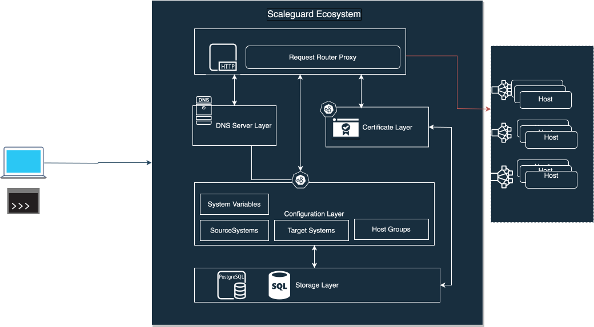
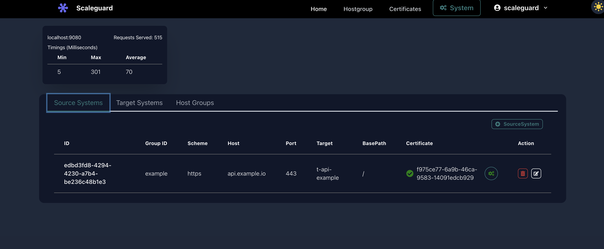

<div align="center">

# 🛡️ ScaleGuard

### The all-in-one service exposure platform

**Load Balancing · Reverse Proxy · Auto-SSL · SSH Tunneling · DNS · Admin UI**\
*All in a single JAR. No Kubernetes required.*

[](https://github.com/dhaneeshtb/scaleguard/actions)
[](https://opensource.org/licenses/MIT)
[](https://openjdk.org/)
[](http://makeapullrequest.com)
[](https://github.com/dhaneeshtb/scaleguard/issues)
[](https://github.com/dhaneeshtb/scaleguard)

[**Quick Start**](#-quick-start-2-minutes) · [**Why ScaleGuard?**](#-why-scaleguard) · [**Documentation**](#-documentation) · [**Contributing**](#-contributing) · [**Roadmap**](#-roadmap)

</div>

---

## ⚡ Quick Start (2 minutes)

```bash
# Clone and build
git clone https://github.com/dhaneeshtb/scaleguard.git
cd scaleguard
mvn clean install -DskipTests

# Run
export SCALEGUARD_ADMIN_USER=admin
export SCALEGUARD_ADMIN_PASSWORD=your-secure-password-here

java -DadminUser=$SCALEGUARD_ADMIN_USER \
     -DadminPassword=$SCALEGUARD_ADMIN_PASSWORD \
     -jar target/scaleguard-1.0-SNAPSHOT.jar
```

**That's it.** ScaleGuard is now running on port 80 with auto-SSL, load balancing, and an admin API ready to go.

### 🐳 Docker

```bash
docker build -f docker/Dockerfile -t scaleguard .
docker run -p 80:80 -p 443:443 \
  -e SCALEGUARD_ADMIN_USER=admin \
  -e SCALEGUARD_ADMIN_PASSWORD=your-secure-password \
  scaleguard
```

### Try it out

```bash
# Health check
curl http://localhost/healthz

# Detailed metrics (Prometheus-compatible)
curl http://localhost/metrics

# View route stats
curl http://localhost/stats
```

---

## 🤔 Why ScaleGuard?

Most teams cobble together **4-5 separate tools** to expose services:

| What you need | Traditional approach | With ScaleGuard |
|---|---|---|
| Reverse proxy | NGINX / Caddy | ✅ Built-in |
| SSL certificates | Certbot / Let's Encrypt client | ✅ Auto-provisioned |
| Tunnel to expose local services | ngrok / Cloudflare Tunnel | ✅ SafeExpose (SSH tunnels) |
| DNS management | CoreDNS / Route53 | ✅ Built-in DNS server |
| Load balancing | HAProxy / ALB | ✅ 4 algorithms (RR, LC, Weighted, Active-Standby) |
| Admin dashboard | Custom / Grafana | ✅ [Admin UI](https://scaleguard.vercel.app) |
| Monitoring | Prometheus + exporters | ✅ `/metrics` endpoint |

**ScaleGuard replaces all of them with a single JAR.**

### Key differentiators

- **🏗️ Single JAR deployment** — No Docker, no Kubernetes, no sidecar. Download → run → done.
- **🔒 SafeExpose** — Expose local apps to the internet securely via SSH tunnels. Like ngrok, but self-hosted and integrated with your load balancer.
- **🔄 Dynamic configuration** — Add routes, targets, and host groups via API. No config files. No restarts.
- **📜 Auto-SSL** — Let's Encrypt certificates provisioned and renewed automatically.
- **⚖️ Smart load balancing** — Round-robin, least-connections, weighted, and active-standby strategies. Configurable per target.
- **☕ Java-native** — Built on Netty for high performance. Perfect for JVM shops that want infrastructure in their stack language.

---

## 📐 Architecture



ScaleGuard is built on **Netty 4.1** for non-blocking, high-performance I/O. Core components:

```
┌──────────────────────────────────────────────────────┐
│                   ScaleGuard Server                   │
│                                                       │
│  ┌─────────┐  ┌──────────┐  ┌─────────────────────┐ │
│  │  DNS     │  │  SSL/TLS │  │  Admin API          │ │
│  │  Server  │  │  (ACME)  │  │  /config /healthz   │ │
│  └────┬─────┘  └────┬─────┘  └─────────┬───────────┘ │
│       │              │                  │             │
│  ┌────▼──────────────▼──────────────────▼───────────┐ │
│  │              Route Table                          │ │
│  │  SourceSystem → TargetSystem → HostGroup(s)       │ │
│  └─────────────────────┬────────────────────────────┘ │
│                        │                              │
│  ┌─────────────────────▼────────────────────────────┐ │
│  │          Best Host Selector                       │ │
│  │  Round-Robin │ Least-Conn │ Weighted │ Standby    │ │
│  └─────────────────────┬────────────────────────────┘ │
│                        │                              │
│  ┌──────────┐  ┌───────▼──────┐  ┌─────────────────┐ │
│  │  Cache    │  │  Proxy       │  │  SSH Tunnel      │ │
│  │  Manager  │  │  (HTTP/WS)   │  │  (SafeExpose)    │ │
│  └──────────┘  └──────────────┘  └─────────────────┘ │
└──────────────────────────────────────────────────────┘
```

---

## 📖 Documentation

### Configuration API

ScaleGuard is fully configurable via REST API. No config files needed.

#### Add a target system
```bash
curl -X POST http://localhost/config/targetsystems \
  -H "Authorization: Bearer $TOKEN" \
  -H "Content-Type: application/json" \
  -d '{
    "groupId": "my-backend",
    "scheme": "http",
    "host": "192.168.1.10",
    "port": "8080",
    "lbStrategy": "ROUND_ROBIN"
  }'
```

#### Add a source system (route)
```bash
curl -X POST http://localhost/config/sourcesystems \
  -H "Authorization: Bearer $TOKEN" \
  -H "Content-Type: application/json" \
  -d '{
    "host": "myapp.example.com",
    "port": "443",
    "scheme": "https",
    "target": "my-backend",
    "autoProcure": true
  }'
```

#### Add host groups (backends)
```bash
curl -X POST http://localhost/config/hostgroups \
  -H "Authorization: Bearer $TOKEN" \
  -H "Content-Type: application/json" \
  -d '{
    "groupId": "my-backend",
    "host": "192.168.1.10",
    "port": "8080",
    "scheme": "http",
    "weight": 3,
    "health": "http://192.168.1.10:8080/health"
  }'
```

### Load Balancing Strategies

| Strategy | Config Value | Description |
|---|---|---|
| **Round Robin** | `ROUND_ROBIN` | Distributes requests evenly across all healthy hosts (default) |
| **Least Connections** | `LEAST_CONNECTIONS` | Routes to the host with the fewest active connections |
| **Weighted** | `WEIGHTED` | Distributes proportionally based on the `weight` field on each host |
| **Active-Standby** | `ACTIVE_STANDBY` | Always routes to the primary; failover to standby on failure |

Set per target system via the `lbStrategy` field.

### Built-in Endpoints

| Endpoint | Auth | Description |
|---|---|---|
| `GET /health` | No | Simple health check: `{"status":"healthy"}` |
| `GET /healthz` | No | Detailed health: uptime, routes, hosts, memory. Returns 503 if unhealthy |
| `GET /metrics` | No | Prometheus text format — scrape with your monitoring stack |
| `GET /stats` | No | Per-route request counts, avg/min/max response times |
| `GET /info` | No | Server version info |
| `GET /config` | Yes | View current configuration |
| `POST /config/*` | Yes | Update configuration (source/target systems, host groups) |

### SafeExpose: Self-hosted ngrok alternative

Expose local services to the internet securely through SSH tunnels:

```bash
# Install the SafeExpose client
git clone https://github.com/dhaneeshtb/scalegurad-safeexpose.git

# Expose your local app running on port 3000
./safeexpose --host your-scaleguard-server.com --port 3000
```

Your local app is now accessible at `https://your-scaleguard-server.com` with auto-SSL. No port forwarding, no firewall changes.

📖 [SafeExpose Documentation →](https://github.com/dhaneeshtb/scalegurad-safeexpose)

### Admin UI

Manage your ScaleGuard instance through a web dashboard:

🔗 **Hosted**: [scaleguard.vercel.app](https://scaleguard.vercel.app/sign-in)

**Run locally**:
```bash
cd admin-ui && npm install && npm start
```



---

## 🔒 Security

- **Never hardcode credentials** — Use environment variables: `SCALEGUARD_ADMIN_USER`, `SCALEGUARD_ADMIN_PASSWORD`
- **Auto-SSL** — Let's Encrypt certificates are auto-provisioned and renewed
- **Rate limiting** — Built-in per-client rate limiting with automatic IP blocking
- **JWT authentication** — Admin API protected with token-based auth
- See [SECURITY.md](SECURITY.md) for our security policy and vulnerability reporting

---

## 🗺️ Roadmap

We're building ScaleGuard in the open. Here's what's coming:

### 🟢 Done
- [x] HTTP/HTTPS reverse proxy
- [x] Auto-SSL via Let's Encrypt
- [x] SSH tunnel-based service exposure (SafeExpose)
- [x] Built-in DNS server
- [x] Admin UI
- [x] Prometheus metrics endpoint
- [x] 4 load balancing algorithms
- [x] Rate limiting & IP blocking
- [x] Request caching
- [x] Kafka async integration
- [x] GitHub Actions CI/CD

### 🟡 In Progress
- [ ] OpenAPI/Swagger documentation for admin API
- [ ] Helm chart for Kubernetes deployment
- [ ] Structured JSON access logs

### 🔵 Planned
- [ ] gRPC proxy support
- [ ] WebAssembly plugin system
- [ ] Geographic routing
- [ ] A/B testing & canary deployments
- [ ] OAuth2/OIDC integration
- [ ] Distributed config backend (etcd/Consul)
- [ ] Web-based terminal for SafeExpose

**Want to work on any of these?** Check out our [good first issues](https://github.com/dhaneeshtb/scaleguard/labels/good%20first%20issue) or [propose a new feature](https://github.com/dhaneeshtb/scaleguard/issues/new?template=feature_request.md).

---

## 🤝 Contributing

We love contributions! ScaleGuard is built by the community, for the community.

### Ways to contribute

| Type | Description |
|---|---|
| 🐛 **Bug Reports** | [Open an issue](https://github.com/dhaneeshtb/scaleguard/issues/new?template=bug_report.md) with reproduction steps |
| 💡 **Feature Requests** | [Suggest ideas](https://github.com/dhaneeshtb/scaleguard/issues/new?template=feature_request.md) for new features |
| 📖 **Documentation** | Fix typos, add examples, improve guides |
| 🧪 **Tests** | Add test coverage for untested components |
| 🔧 **Code** | Pick up an issue and submit a PR |

### Quick contribution guide

```bash
# Fork and clone
git clone https://github.com/YOUR-USERNAME/scaleguard.git
cd scaleguard

# Create a branch
git checkout -b feat/your-feature

# Build and test
mvn clean test

# Commit and push
git commit -m "feat: add your feature"
git push origin feat/your-feature
```

Then [open a PR](https://github.com/dhaneeshtb/scaleguard/compare) — we'll review it promptly!

📖 See [CONTRIBUTING.md](CONTRIBUTING.md) for detailed guidelines.

---

## 📊 Compared to alternatives

| Feature | ScaleGuard | NGINX | Traefik | Caddy | ngrok |
|---|:---:|:---:|:---:|:---:|:---:|
| Reverse proxy | ✅ | ✅ | ✅ | ✅ | ❌ |
| Load balancing | ✅ 4 algorithms | ✅ | ✅ | ✅ | ❌ |
| Auto-SSL | ✅ | ❌ (needs Certbot) | ✅ | ✅ | N/A |
| SSH tunneling | ✅ SafeExpose | ❌ | ❌ | ❌ | ✅ |
| Built-in DNS | ✅ | ❌ | ❌ | ❌ | ❌ |
| Admin UI | ✅ | ❌ (NGINX Plus only) | ✅ (paid) | ❌ | ✅ (paid) |
| Dynamic config API | ✅ | ❌ (needs reload) | ✅ | ✅ | ✅ |
| Single binary/JAR | ✅ | ✅ | ✅ | ✅ | ✅ |
| Self-hosted | ✅ | ✅ | ✅ | ✅ | ❌ (paid) |
| Prometheus metrics | ✅ | ❌ (needs exporter) | ✅ | ❌ | ❌ |
| Free & open source | ✅ MIT | ✅ (basic) | ✅ (basic) | ✅ | ❌ |
| Java/JVM native | ✅ | ❌ C | ❌ Go | ❌ Go | ❌ Go |

---

## 🌟 Star History

If ScaleGuard is useful to you, please consider giving it a ⭐ — it helps others discover the project!

[](https://star-history.com/#dhaneeshtb/scaleguard&Date)

---

## 📜 License

ScaleGuard is released under the [MIT License](LICENSE). Use it freely in personal and commercial projects.

## 💬 Contact & Community

- 📧 Email: dhaneeshtnair@gmail.com
- 🐛 Issues: [github.com/dhaneeshtb/scaleguard/issues](https://github.com/dhaneeshtb/scaleguard/issues)
- 💡 Discussions: [github.com/dhaneeshtb/scaleguard/discussions](https://github.com/dhaneeshtb/scaleguard/discussions)

---

<div align="center">

**Built with ❤️ and ☕ Java**

*If ScaleGuard saves you time, [give it a star](https://github.com/dhaneeshtb/scaleguard) ⭐*

</div>
